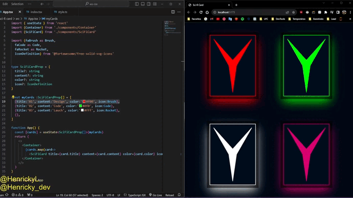

# Sci-fi card

## init

* Vite:
  - `npm create vite@latest`
* StyledComponent 
  - `npm install styled-components`
* Icons 
  - `npm i --save @fortawesome/fontawesome-svg-core`
  - `npm install --save @fortawesome/free-solid-svg-icons`
  - `npm install --save @fortawesome/react-fontawesome`
  - [reference](https://fontawesome.com/v5/docs/web/use-with/react)
* [CSS Clip Path Maker](https://bennettfeely.com/clippy/)
  -

- reference: [Simple CSS Sci-Fi Card and Hover Effect - online tutorials](https://youtu.be/HczHaYdxHOg)